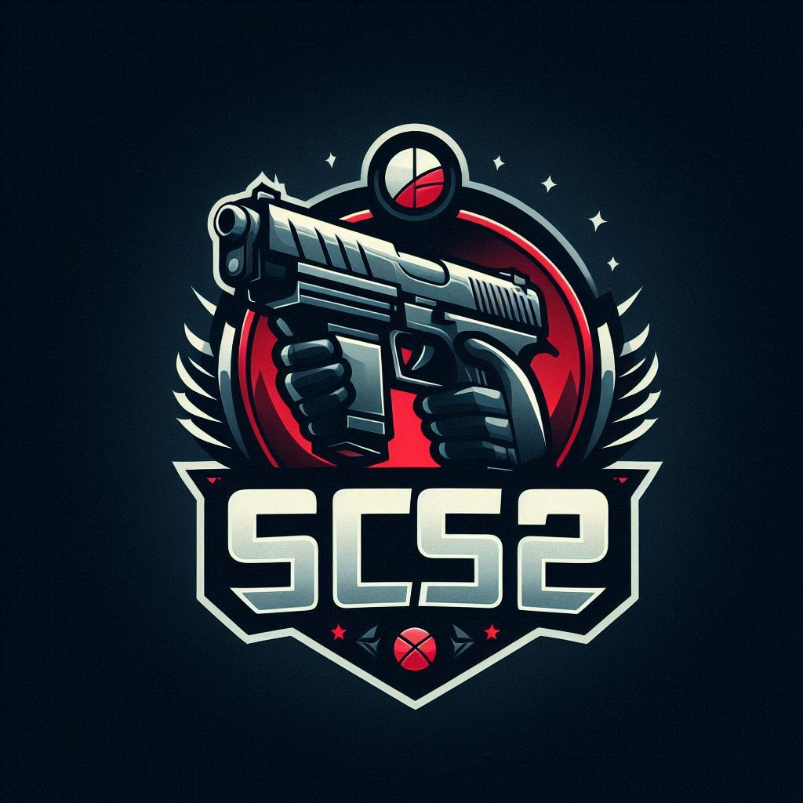
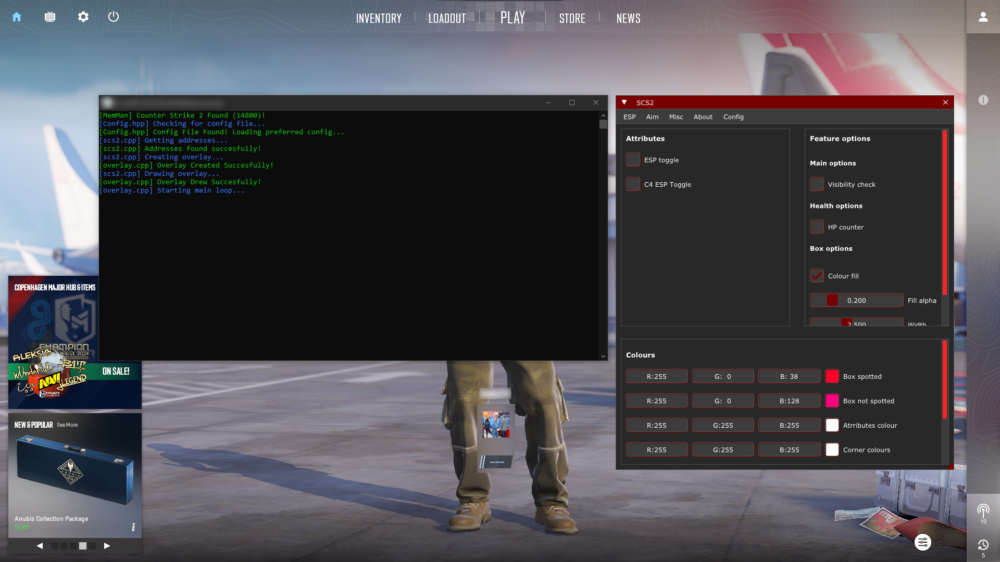
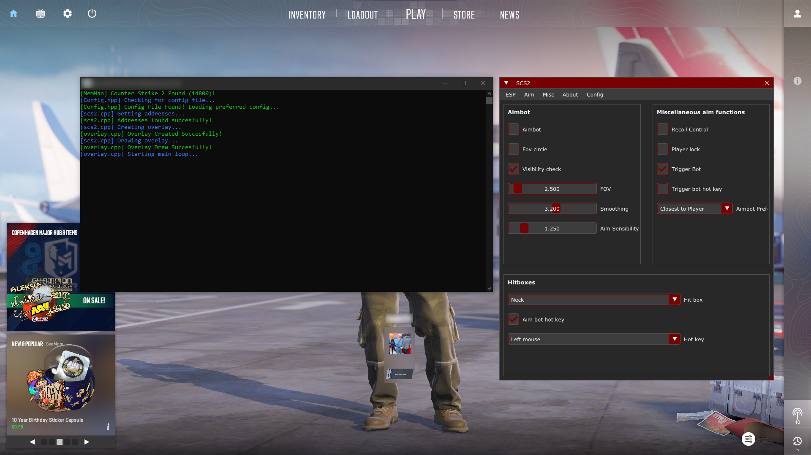
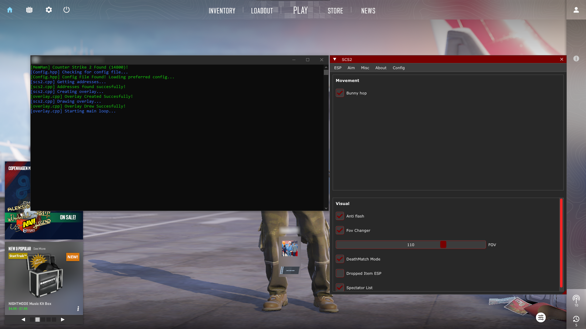

Welcome to **Sneaky's CS2 Menu (SCS2)**

A unique and innovative tool designed to enhance your gaming experience in [Counter-Strike 2 (CS2)](https://store.steampowered.com/app/730). My menu is designed to be sleek and user friendly, and is engineered to be semi-external, minimizing detection risk while providing a suite of essential features to win every game!

<b><a href='https://github.com/Svxy/SCS2/releases/download/2/SCS2.exe'>Download</a> today!</b>

## Table of contents
- [Compiling](#Compiling)
- [Usage](#Usage)
  - [Update Offsets](#update-cs2-offsets-2-methods)
  - [Running](#run)
  - [UI Controls](#togglekill-ui)
  - [Using Icon Fonts](#using-icon-fonts)
- [Disclaimer](#Disclaimer)
- [Features](#Features)
- [Credits](#Credits)
- [LICENSE](#License)
- [Previews](#Previews)

## Compiling
Open `scs2.sln` in Visual Studio, set build configuration to **Release | x64**.\
Press Build solution, and you should receive an **SCS2.exe** file at `SCS2/x64/Release/`

## Usage

### Update CS2 Offsets (2 Methods)
1. Run `updateoffsets.cmd` in the same folder as `SCS2.exe`
2. Manually update from [a2x's repo](https://github.com/a2x/cs2-dumper/blob/main/output) and download: `buttons.json`, `offsets.json`, `client.dll.json`.

### Run
1. Run `SCS2.exe` from the release path.
2. Follow Terminal instructions.
3. Wait for Load.

### Toggle/Kill UI
- Toggle UI: `Insert` key.
- Terminate UI: `End` key.

### Using Icon Fonts
Copy the fonts folder to the same location as `SCS2.exe`.

## Disclaimer
> [!CAUTION]
> **This tool is designed to be semi-external and aims to reduce detection risk. However, it is still a cheat, and using it may violate terms of service. I am not responsible for any account bans. USE AT YOUR OWN RISK.**

> [!IMPORTANT]
> I am not responsible for any **banned accounts** or **misuse** of this application.\
> This tool was created for educational purposes to explore [VAC (Valve Anti-Cheat)](https://help.steampowered.com/faqs/view/571A-97DA-70E9-FF74).\
> **USE AT YOUR OWN RISK**.

> [!NOTE]
> **This cheat is only tested on [VAC (Valve Anti-Cheat)](https://help.steampowered.com/faqs/view/571A-97DA-70E9-FF74) with minimal bans reported.**

## Features
- **ESP**
  - Health bar with optional HP counter
  - Player names and weapon icons
  - Bounding boxes with customizable colors and thickness
  - Skeleton, joints, and head outlines
  - Snap lines and distance indicators

- **Aim**
  - Aimbot with player lock
  - Recoil control system
  - Trigger bot with adjustable delay

- **Miscellaneous**
  - Bunny hop
  - Anti-flash
  - Deathmatch Mode
  - Dropped item & C4 ESP (may impact performance)
  - Bomb timer
  - Spectator list

> [!CAUTION]
> **Features like Bunny Hop and Anti-Flash use Windows API functions that might increase the risk of detection.**

## Credits
- [a2x/cs2-dumper](https://github.com/a2x/cs2-dumper)
- [nlohmann/json](https://github.com/nlohmann/json)
- [ocornut/imgui](https://github.com/ocornut/imgui)

## License
> [!NOTE]
> This repository is licensed under the [GNU-3.0](https://github.com/svxy/scs2/blob/master/LICENSE) License.

  

    <h2>Previews</h2>
  

